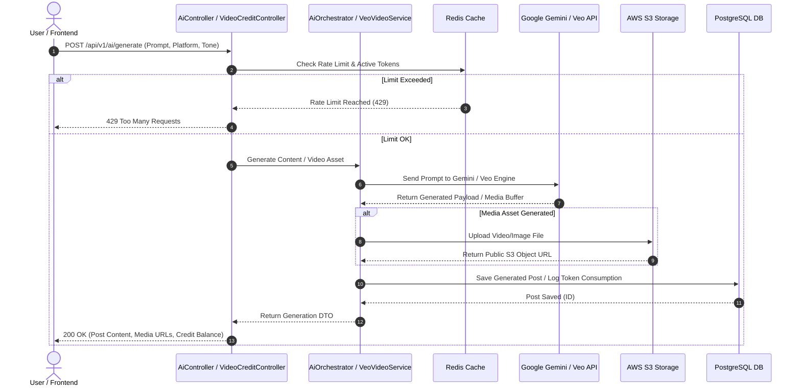
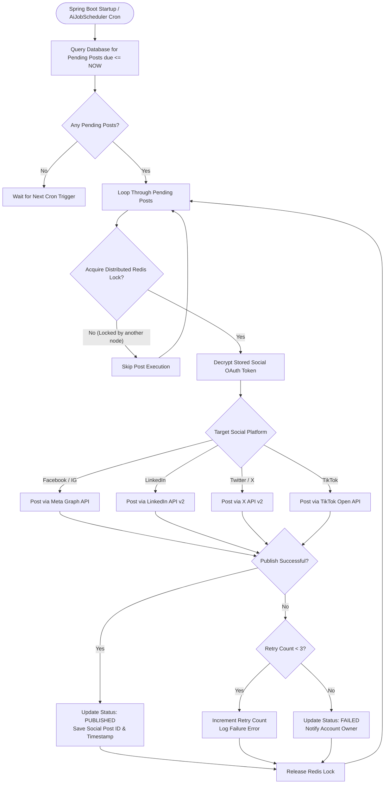
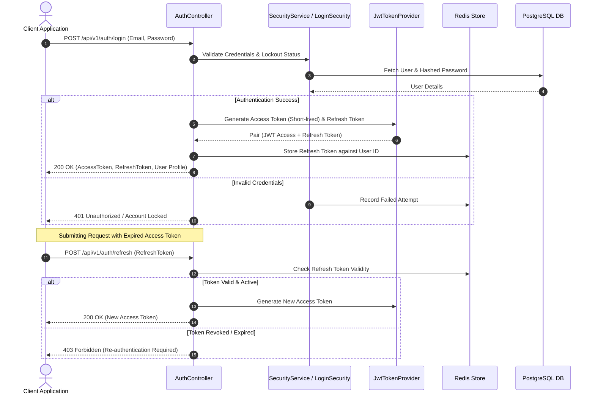

# AI Social Media Automation - Enterprise Backend


An enterprise-grade, high-performance Spring Boot backend powering the AI Social Media Automation SaaS platform. The system handles AI multi-platform post generation (text, images, Google Veo video), multi-account social scheduling, automated publishing, community management, analytics, review automation, Razorpay payment processing, and comprehensive administrative telemetry.

---

## 📋 Table of Contents
- [Architecture & Tech Stack](#-architecture--tech-stack)
- [System Architecture Diagram](#-system-architecture-diagram)
- [Key Features & Subsystems](#-key-features--subsystems)
- [System Flowcharts](#-system-flowcharts)
  - [AI Content & Video Generation Flow](#1-ai-content--video-generation-flow)
  - [Social Auto-Scheduler & Publishing Workflow](#2-social-auto-scheduler--publishing-workflow)
  - [Authentication & JWT Refresh Lifecycle](#3-authentication--jwt-refresh-lifecycle)
- [API Endpoints Overview](#-api-endpoints-overview)
- [Environment Configuration](#-environment-configuration)
- [Database Schema & Migrations](#-database-schema--migrations)
- [Local Development Setup](#-local-development-setup)
- [Production & Security Features](#-production--security-features)

---

## 🏗️ Architecture & Tech Stack

- **Core Framework**: Java 21 LTS & Spring Boot `3.3.4`
- **Security & Auth**: Spring Security 6, JWT Authentication, Refresh Token Rotations, AES-128 Credential Encryption, Rate Limiting (Bucket4j + Redis)
- **AI Integrations**: Spring AI with Google Gemini API & Google Veo Video Generation Engine (`VeoVideoService`)
- **Database & Persistence**: PostgreSQL, Spring Data JPA / Hibernate, Flyway Database Migrations
- **Caching & Locks**: Redis (`spring-boot-starter-data-redis`), Distributed Locking (`DistributedLockService`)
- **Cloud Media Storage**: AWS S3 via Spring Cloud AWS (`spring-cloud-aws-starter-s3`)
- **Billing & PDF Generation**: Razorpay Java SDK, OpenPDF for automated invoice generation
- **Resilience & Monitoring**: Resilience4j Circuit Breakers, Micrometer Prometheus Metrics, OpenTelemetry Tracing, Spring Actuator

---

## 📐 System Architecture Diagram

```mermaid
graph TB
    subgraph Client Layer
        FE[React TypeScript Frontend]
        Mobile[Mobile / API Clients]
    end

    subgraph Security & Edge Layer
        SecurityFilter[Spring Security + JWT Filter]
        RateLimiter[Bucket4j / Redis Rate Limiter]
    end

    subgraph Controller Layer
        AuthController[AuthController]
        AiController[AiController]
        PostController[PostController]
        SocialController[SocialController]
        PaymentController[PaymentController]
        AdminController[AdminManagementController]
    end

    subgraph Service Layer
        AiOrchestrator[AiOrchestrator / PromptEngine]
        PublisherService[PublisherService / AutoPostService]
        SocialService[SocialService]
        VeoVideoService[VeoVideoService / VideoCreditService]
        PaymentService[PaymentService / SubscriptionService]
        AdminService[AdminManagementService / FraudDetection]
    end

    subgraph Persistence & External Integrations
        DB[(PostgreSQL Database)]
        Redis[(Redis Cache / Rate Limit)]
        S3[AWS S3 Bucket]
        Gemini[Google Gemini AI API]
        Razorpay[Razorpay Gateway]
        SocialAPIs[Meta / LinkedIn / X / TikTok APIs]
    end

    FE --> SecurityFilter
    Mobile --> SecurityFilter
    SecurityFilter --> RateLimiter
    RateLimiter --> AuthController & AiController & PostController & SocialController & PaymentController & AdminController

    AiController --> AiOrchestrator & VeoVideoService
    PostController --> PublisherService
    SocialController --> SocialService
    PaymentController --> PaymentService
    AdminController --> AdminService

    AiOrchestrator --> Gemini
    VeoVideoService --> Gemini & S3
    PublisherService --> SocialAPIs & S3
    PaymentService --> Razorpay
    
    Service Layer --> DB
    Service Layer --> Redis
```

---

## 🌟 Key Features & Subsystems

1. **AI Content & Media Engine**:
   - Multi-platform post text generation tailored to custom brand voices.
   - Dynamic prompt orchestration (`PromptEngine`, `PromptLoader`, `ProviderRouter`).
   - AI Image generation and Google Veo Video generation pipeline (`VeoVideoService`).
   - Token & Video Credit management system (`VideoCreditService`, `VideoLimitService`).

2. **Social Publishing & Scheduling Pipeline**:
   - Dynamic scheduled posting via `AiJobScheduler` & `AutoPostService`.
   - Multi-channel API adapters for Facebook, Instagram, LinkedIn, Twitter/X, and TikTok.
   - Intelligent best-time-to-post recommendations (`AiBestTimeService`).
   - Evergreen post automation & content recycling (`EvergreenService`).

3. **Community & Review Butler**:
   - Automated monitoring of customer reviews & comment management (`CommunityManagerService`).
   - Auto-generated AI replies for Facebook reviews and page interactions (`FacebookReviewService`).

4. **Multi-Tenant Admin & Security Operations**:
   - System stats telemetry, memory, and database connection metrics (`AdminAnalyticsService`).
   - Token audit logging (`AdminManagementService`).
   - Automated fraud & anomaly detection (`FraudDetectionService`).
   - User role governance, account suspensions, system broadcasts, and support ticket management.

5. **Monetization & Invoicing**:
   - Razorpay payment gateway integration for subscriptions and credit packs.
   - Automated PDF invoice creation (`PdfService` via OpenPDF).
   - Subscription tier rules (Free, Pro, Enterprise) enforced via `SubscriptionService`.

6. **Compliance**:
   - Facebook Data Deletion callback handling (`FacebookDataDeletionService` / `DataDeletionController`).

---

## 🔄 System Flowcharts

### 1. AI Content & Video Generation Flow



---

### 2. Social Auto-Scheduler & Publishing Workflow



---

### 3. Authentication & JWT Refresh Lifecycle



---

## 📡 API Endpoints Overview

| Controller | Base Path | Core Responsibilities |
| :--- | :--- | :--- |
| **`AuthController`** | `/api/v1/auth` | Login, Register, Verify Email, Password Reset, Refresh Token, MFA |
| **`AiController`** | `/api/v1/ai` | Multi-platform AI Post Generation, AI Strategy, Campaign creation |
| **`VideoCreditController`** | `/api/v1/video-credits` | Veo Video generation, credit balance, package checkout |
| **`PostController`** | `/api/v1/posts` | Drafts, scheduling, instant publishing, post deletion, approval workflows |
| **`SocialController`** | `/api/v1/social` | OAuth account link/unlink for Facebook, IG, LinkedIn, X, TikTok |
| **`AnalyticsController`** | `/api/v1/analytics` | Reach, impressions, engagement rates, automated PDF performance reports |
| **`PaymentController`** | `/api/v1/payments` | Razorpay order creation, payment verification, tier upgrading, invoice downloads |
| **`AdminManagementController`** | `/api/v1/admin` | User management, token usage audit, system metrics, fraud management, broadcasts |
| **`CommunityController`** | `/api/v1/community` | Unified inbox comments, auto-reply triggers |
| **`FacebookReviewController`** | `/api/v1/reviews/facebook` | Automated Facebook page review monitoring & AI responses |
| **`MicrositeController`** | `/api/v1/microsites` | Custom AI-generated link-in-bio landing microsites |
| **`EvergreenController`** | `/api/v1/evergreen` | Content recycling & evergreen queue management |
| **`DataDeletionController`** | `/api/v1/data-deletion` | Meta compliance Facebook user data deletion callback |

---

## ⚙️ Environment Configuration

Copy `.env.example` to `.env` in the backend root directory before starting the application:

```ini
# Database Configuration
DB_USERNAME=postgres
DB_PASSWORD=your_secure_password
REDIS_HOST=localhost
REDIS_PORT=6379

# JWT & Security Secrets (JWT_SECRET min 64 hex characters, ENCRYPTION_SECRET 16 chars)
JWT_SECRET=404E635266556A586E3272357538782F413F4428472B4B6250645367566B5970
ENCRYPTION_SECRET=1234567890123456

# AI Credentials
GEMINI_API_KEY=AIzaSy...

# Cloud Media (AWS S3)
AWS_ACCESS_KEY_ID=AKIA...
AWS_SECRET_ACCESS_KEY=your_secret_key
AWS_S3_BUCKET_NAME=your_social_media_bucket

# Social OAuth Integration Credentials
FB_APP_ID=your_fb_id
FB_APP_SECRET=your_fb_secret
LINKEDIN_CLIENT_ID=your_linkedin_id
LINKEDIN_CLIENT_SECRET=your_linkedin_secret
X_CLIENT_ID=your_x_id
X_CLIENT_SECRET=your_x_secret

# Payment Gateway (Razorpay)
RAZORPAY_KEY_ID=rzp_live_...
RAZORPAY_KEY_SECRET=your_razorpay_secret
RAZORPAY_WEBHOOK_SECRET=your_webhook_secret

# Mail Configuration
SMTP_USERNAME=your_email@gmail.com
SMTP_PASSWORD=your_app_password
```

---

## 🗄️ Database Schema & Migrations

Database schema migrations are automatically handled by **Flyway**.
Migration scripts are stored under `src/main/resources/db/migration/`.

Key tables include:
- `users`: User accounts, password hashes, roles (`ROLE_USER`, `ROLE_ADMIN`, `ROLE_OWNER`), MFA tokens.
- `social_accounts`: Linked OAuth credentials (encrypted at rest using `ENCRYPTION_SECRET`).
- `posts`: Generated content, media URLs, scheduled timestamps, status (`DRAFT`, `SCHEDULED`, `PUBLISHED`, `FAILED`).
- `ai_token_usage`: Audit logs of Gemini API consumption per user and request.
- `subscriptions` & `payments`: Tier memberships, Razorpay order IDs, transaction histories.
- `video_credits`: Credit balance for Google Veo video generation.
- `support_tickets`: Support requests and resolution statuses.

---

## 🚀 Local Development Setup

### Prerequisites
- **Java 21 JDK** installed and configured in system path.
- **Maven 3.9+**
- **PostgreSQL 15+** running on port `5432`
- **Redis** running on port `6379`

### Build & Run
```bash
# Navigate to backend directory
cd Ai_Social_Media_Backedn

# Build project with Maven
mvn clean package -DskipTests

# Run Spring Boot Application
mvn spring-boot:run
```

The application starts on `http://localhost:8080`.  
OpenAPI / Swagger documentation is available at `http://localhost:8080/swagger-ui.html`.

---

## 🛡️ Production & Security Features

- **Sensitive Data Encryption**: Social API tokens and client secrets are encrypted with AES-128 before saving to PostgreSQL.
- **Brute Force Protection**: IP and user attempt locking via `LoginSecurityService`.
- **CORS Protection**: Enforces strict origin matching against `FRONTEND_URL`.
- **Actuator Telemetry**: Health checks, Prometheus metrics endpoint at `/actuator/prometheus`.
- **Circuit Breaker**: Resilience4j guards against downstream API outages (Google AI, AWS S3, Meta API).